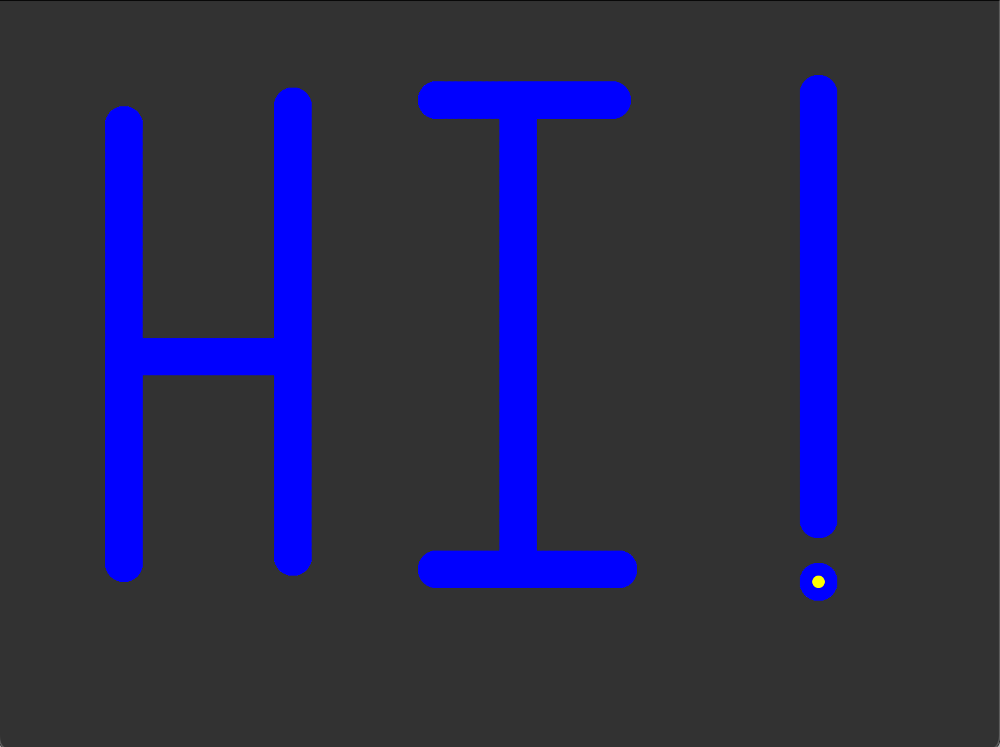

# 🎨 Worksheet 2: Keyboard Sketcher

**Let's make a simple drawing program!** You'll control a "pen" with the arrow keys to draw anything you want. This worksheet will teach you how to handle continuous key presses for smooth movement, a key skill for making better games.



## 📝 IMPORTANT: Type, Don't Copy!

Remember, typing the code helps your fingers learn the keyboard shortcuts and syntax. **Run your code after each part to see what you've built!** The goal is to understand _why_ the code works.

---

## Part 1: Make a Dot

First, let's create a "pen" (a small circle) that will eventually be our drawing tool.

```python
# Pen's starting position
pen_x = 400
pen_y = 300
pen_speed = 4

def setup():
    size(800, 600)

def draw():
    background(50, 50, 50) # Dark grey background

    # Draw the pen
    fill(255, 255, 0) # Yellow
    no_stroke() # Removes the black outline from shapes
    circle(pen_x, pen_y, 10)

run_sketch()
```

**Run it!** You should see a dark window with a small yellow dot in the middle. It doesn't move yet, but we'll fix that soon.

### 🔬 Experiment Time!

Before moving on, let's play with the code you just wrote. Try to solve these small challenges.

<details markdown="1">
<summary>🤔 Challenge: Can you make the window a perfect square?</summary>

<details markdown="1">
<summary>💡 Hint 1</summary>
The `size()` function in `setup()` controls the window's width and height.
</details>

<details markdown="1">
<summary>💡 Hint 2</summary>
Change `size(800, 600)` to `size(400, 400)`. Remember to change it back!
</details>
</details>

<details markdown="1">
<summary>🤔 Challenge: Can you change the background to pure black?</summary>

<details markdown="1">
<summary>💡 Hint 1</summary>
The `background()` function uses (Red, Green, Blue) values from 0-255. Black is the absence of all color. You can find any color you want with an online tool like [rgbcolorpicker.com](https://rgbcolorpicker.com/).
</details>
<details markdown="1">
<summary>💡 Hint 2</summary>
Use `background(0, 0, 0)`. What numbers would you use for pure white?
</details>
</details>

<details markdown="1">
<summary>🤔 Challenge: Can you make the pen start in the top-left corner?</summary>

<details markdown="1">
<summary>💡 Hint 1</summary>
The top-left corner is at coordinate (0, 0).
</details>
<details markdown="1">
<summary>💡 Hint 2</summary>
You need to change the starting values for the `pen_x` and `pen_y` variables at the top of your code.
</details>
</details>

---

## Part 2: Handling Key Presses

For smooth movement, we need to know when a key is being **held down**. We'll use **boolean** variables to do this. A boolean is the simplest type of variable: it can only ever be `True` or `False`. We'll use them like light switches to remember if a key is currently down.

Add these new variables and functions to your code.

```python
# --- At the top of your file ---
# Pen's starting position
pen_x = 400
pen_y = 300
pen_speed = 4

# NEW: Boolean variables to track which keys are held down
up_pressed = False
down_pressed = False
left_pressed = False
right_pressed = False

# --- At the bottom of your file, before run_sketch() ---
def key_pressed():
    global up_pressed, down_pressed, left_pressed, right_pressed
    if key_code == UP:
        up_pressed = True
    if key_code == DOWN:
        down_pressed = True
    if key_code == LEFT:
        left_pressed = True
    if key_code == RIGHT:
        right_pressed = True

def key_released():
    global up_pressed, down_pressed, left_pressed, right_pressed
    if key_code == UP:
        up_pressed = False
    if key_code == DOWN:
        down_pressed = False
    if key_code == LEFT:
        left_pressed = False
    if key_code == RIGHT:
        right_pressed = False
```

### 🔬 Experiment Time!

This code doesn't change the visuals yet, but a lot is happening! Let's investigate what these new functions do.

- **See the Input:** Add `print("A key was pressed!")` inside the `key_pressed()` function. Run the code and press some keys. Look at the **console area** below your code to see the message appear.

- **Investigate the Keys:** Now change the print statement to `print("Value of key_code:", key_code)`.

  - Press an arrow key. Notice the console prints a number.
  - Press a letter key like 'w'. Notice it prints a different number.
  - `key_code` stores a unique number for every key on your keyboard. To see what the arrow key numbers are, add this line to your `setup()` function: `print("The code for the UP arrow is:", UP)`

- **Check the Boolean:** In your `key_pressed()` function, right after `up_pressed = True`, add `print("up_pressed is now:", up_pressed)`. Do the same in `key_released()` for `up_pressed = False`. Watch how the variable changes from `False` to `True` and back again in the console when you press and release the up arrow. This is how our program remembers the key's state!

---

## Part 3: Make the Dot Move!

Now, let's use our boolean variables inside the `draw()` loop to finally move the pen. Because `draw()` runs over and over, it will check these `True`/`False` states 60 times a second, creating smooth movement.

Update your `draw()` function like this:

```python
def draw():
    global pen_x, pen_y
    background(50, 50, 50)

    # --- ADD THIS MOVEMENT LOGIC ---
    # Check the booleans 60 times per second
    # In Python, "if up_pressed:" is the same as "if up_pressed == True:"
    if up_pressed:
        pen_y = pen_y - pen_speed
    if down_pressed:
        pen_y = pen_y + pen_speed
    if left_pressed:
        pen_x = pen_x - pen_speed
    if right_pressed:
        pen_x = pen_x + pen_speed
    # ---------------------------------

    # Draw the pen
    fill(255, 255, 0)
    no_stroke()
    circle(pen_x, pen_y, 10)
```

**Run it!** Hold down the arrow keys. The yellow dot should now move smoothly around the screen!

### 🔬 Experiment Time!

<details markdown="1">
<summary>🤔 Challenge: The pen feels a bit slow. How can you make it faster?</summary>

<details markdown="1">
<summary>💡 Hint 1</summary>
Look at the variables at the very top of your code. Is there one that sounds like it controls speed?
</details>
<details markdown="1">
<summary>💡 Hint 2</summary>
Try changing the value of the `pen_speed` variable to `10`. What about `1`?
</details>
</details>

- **Break It (On Purpose!):** Let's see what happens if a key gets "stuck". In your `key_released()` function, add a `#` in front of the two lines for the `UP` key. A `#` tells Python to ignore a line, turning it into a **comment**.

  ```python
  # if key_code == UP:
  #     up_pressed = False
  ```

  Now run the code. Press the up arrow once and let go. The pen keeps moving up forever! This is because the `up_pressed` variable was set to `True` but never got set back to `False`. This is why `key_released()` is so important. (Remember to remove the `#`s before moving on).

<details markdown="1">
<summary>🤔 Challenge: Stop the pen from flying off the screen!</summary>

<details markdown="1">
<summary>Hint 1: Where to check?</summary>
You'll need `if` statements inside your `draw()` loop to constantly check the pen's position after it has moved.
</details>
<details markdown="1">
<summary>Hint 2: How to check the left edge?</summary>
To stop it from going past the left edge (where x is 0), you can check `if pen_x < 0:`. Inside that `if` statement, you need to set `pen_x` back to 0.
</details>
<details markdown="1">
<summary>Hint 3: How to check the other edges?</summary>
You can set its position back to the edge, like `pen_x = 0`. The screen's width and height are stored in special variables called `width` and `height`. You'll need to check if `pen_x > width`, `pen_y < 0`, and `pen_y > height`.
</details>
</details>

---

## Part 4: Leaving a Trail

A moving dot is cool, but a drawing program needs to draw! How can we remember every position the pen has visited? With a **list**! A list is a special type of variable that can hold many values in order.

First, add empty lists at the top of your code:

```python
# At the top of your file, with your other variables
trail_x = []
trail_y = []
```

Now, update your `draw()` function to save the pen's position in every frame and then draw the entire trail.

```python
def draw():
    global pen_x, pen_y
    background(50, 50, 50)

    # Move the pen (same as before)
    if up_pressed: pen_y = pen_y - pen_speed
    if down_pressed: pen_y = pen_y + pen_speed
    if left_pressed: pen_x = pen_x - pen_speed
    if right_pressed: pen_x = pen_x + pen_speed

    # --- ADD THIS NEW CODE ---
    # Add the current pen position to our trail lists
    trail_x.append(pen_x)
    trail_y.append(pen_y)

    # Draw the entire trail using a loop
    i = 0
    while i < len(trail_x):
        fill(100, 200, 255) # Light blue trail
        no_stroke()
        circle(trail_x[i], trail_y[i], 5)
        i = i + 1
    # --------------------------

    # Draw the pen on top so it's visible
    fill(255, 255, 0)
    no_stroke()
    circle(pen_x, pen_y, 10)
```

**Run it!** Move the dot around. It should now leave a beautiful light blue trail wherever it goes!

### What's happening?

- `trail_x = []` creates an empty list.
- `trail_x.append(pen_x)` adds the current value of `pen_x` to the end of the `trail_x` list.
- `while i < len(trail_x):` This is a **loop**. `len(trail_x)` gets the total number of items in the list. The loop will run as long as our counter variable `i` is less than the total length.
- `circle(trail_x[i], trail_y[i], 5)` The `[i]` is how we get an item from a list at a specific position (its **index**). As `i` counts up (0, 1, 2, ...), we get each saved coordinate pair to draw one circle from our trail.
- `i = i + 1` This is crucial! It increases our counter `i` by one each time the loop runs, so we move on to the next point in the trail. If you forget this, you get an infinite loop!
- **The two lists, `trail_x` and `trail_y`, work together.** The first x-position is at `trail_x[0]` and the first y-position is at `trail_y[0]`. The tenth x-position is at `trail_x[9]` and the tenth y-position is at `trail_y[9]`. They always match up!

### 🔬 Experiment Time!

<details markdown="1">
<summary>🤔 Challenge: What determines the spacing of the dots in your trail?</summary>
<p>Set the trail circle size to 2 and the <code>pen_speed</code> to 1. Draw a line. Now, set <code>pen_speed</code> to 20. Draw another line. Why are the dots spaced out more when the speed is higher?</p>
<details markdown="1">
<summary>💡 Hint</summary>
The `draw()` loop runs at the same rate no matter what (60 times per second). In each frame, we add one dot. If the pen moves a larger distance between frames (higher speed), what does that do to the distance between the dots?
</details>
</details>

- 💡 **Did you notice?** We didn't need to write `global trail_x` in `draw()`. This is because Python lets you _change the contents_ of a list (like using `.append()`) without the `global` keyword. You only need `global` when you want to replace the entire variable with something new (like `pen_x = pen_x + 1`).

---

## 🎉 Complete Program!

You've made an interactive drawing program! This is a huge step. You learned how to handle smooth keyboard input and how to use lists to remember and draw hundreds of objects on the screen.

## 🚀 Make It Your Own! (Challenges)

<details markdown="1">
<summary>🎮 Challenge 1: Clear the Screen</summary>

Add a feature so that when you press the **'c' key**, the drawing clears. You can clear a list by setting it back to an empty one, like this: `trail_x = []`.

<details markdown="1">
<summary>💡 Need help?</summary>
You need to modify the `key_pressed()` function. For letter keys, we check `key` instead of `key_code`. Inside an `if key == 'c':` block, you'll need to reset both the `trail_x` and `trail_y` lists.
</details>
<details markdown="1">
<summary>✅ Solution</summary>

Add this to your `key_pressed()` function:

```python
# In key_pressed()
# ... your other key code for arrows ...
    global trail_x, trail_y
    if key == 'c':
        trail_x = []  # Make the list empty again
        trail_y = []  # Make this one empty too!
```

</details>
</details>

<details markdown="1">
<summary>🎮 Challenge 2: Change Colors On The Fly</summary>

Make it so pressing 'r' changes the trail to red, 'g' to green, and 'b' to blue.

- Red is `(255, 0, 0)`
- Green is `(0, 255, 0)`
- Blue is `(0, 0, 255)`

<details markdown="1">
<summary>💡 Need help?</summary>
1.  Create three new variables at the top for the trail color: `trail_r = 100`, `trail_g = 200`, `trail_b = 255`.
2.  In `key_pressed()`, add `if` statements for 'r', 'g', and 'b' that change the values of those variables. Remember to make them `global`!
3.  In your `while` loop in `draw()`, change the `fill()` command to use these variables: `fill(trail_r, trail_g, trail_b)`.
</details>
<details markdown="1">
<summary>✅ Solution</summary>

```python
# At top of file
trail_r, trail_g, trail_b = 100, 200, 255

# In key_pressed()
def key_pressed():
    #...
    global trail_r, trail_g, trail_b
    if key == 'r':
        trail_r, trail_g, trail_b = 255, 0, 0
    if key == 'g':
        trail_r, trail_g, trail_b = 0, 255, 0
    if key == 'b':
        trail_r, trail_g, trail_b = 0, 0, 255

# In the while loop in draw()
fill(trail_r, trail_g, trail_b)
```

</details>
</details>

<details markdown="1">
<summary>🎮 Challenge 3: Eraser and Lift-Pen Mode</summary>

Make it so holding down the **mouse button** makes the pen "erase" the trail. When you release the mouse, it should go back to drawing mode. py5 has a built-in boolean variable `is_mouse_pressed` that is `True` when the mouse is held down.

<details markdown="1">
<summary>💡 Need help?</summary>
The "eraser" is just drawing with the same color as the background! Inside your `while` loop, you'll need an `if/else` statement that checks `is_mouse_pressed`. If it's true, `fill()` with the background color. If it's false, `fill()` with the trail color.
</details>
<details markdown="1">
<summary>✅ Solution</summary>

Inside your `draw()` function, just before you add points to the trail, check if the mouse is pressed.

```python
# Inside draw()
# ... after movement code ...

# Check for eraser mode
is_erasing = False
if is_mouse_pressed:
    is_erasing = True

# When adding to trail, you could also add the mode
# (This is an advanced idea, an easier way is in the next hint)

# Easiest way: just change the color when drawing the trail
# Inside your while loop:
if is_mouse_pressed:
    fill(50, 50, 50)  # The background color
else:
    fill(trail_r, trail_g, trail_b) # The normal trail color

circle(trail_x[i], trail_y[i], 20) # Use a bigger circle for erasing
```

</details>
<summary>🚀 Bonus Idea</summary>
Can you use this same idea to **stop drawing** when the `SHIFT` key is held down? This would let you move the pen to a new spot and draw disconnected lines! (Hint: py5 has a variable `is_key_pressed` that is `True` if *any* key is down, and `key` tells you which one it is. You could check `if is_key_pressed and key == SHIFT:`).
</details>
